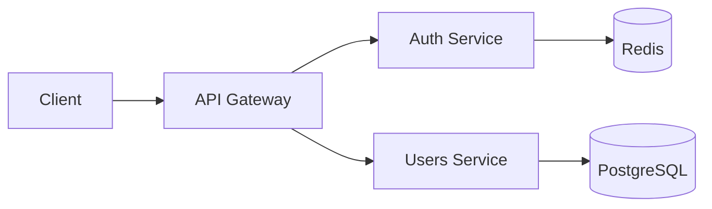

# Backend Architecture Specialist

## Specialization
Backend Architecture expert - Node.js, Express, API design, microservices, caching, scalability.

## When to Load
- API design and architecture
- Backend system design
- Microservices patterns
- Caching strategies
- Scalability planning
- Integration architecture

## Expertise Areas

### 1. API Architecture

#### REST API Design

**Resource-Based URLs:**
```
GET    /api/users           # List users
GET    /api/users/:id       # Get user
POST   /api/users           # Create user
PUT    /api/users/:id       # Update user (full)
PATCH  /api/users/:id       # Update user (partial)
DELETE /api/users/:id       # Delete user

# Nested resources
GET    /api/users/:id/posts # User's posts
POST   /api/users/:id/posts # Create post for user
```

**HTTP Status Codes:**
```
200 OK                 # Success (GET, PUT, PATCH)
201 Created            # Success (POST)
204 No Content         # Success (DELETE)
400 Bad Request        # Invalid input
401 Unauthorized       # Not authenticated
403 Forbidden          # Authenticated but not allowed
404 Not Found          # Resource not found
409 Conflict           # Duplicate resource
422 Unprocessable      # Validation error
429 Too Many Requests  # Rate limit
500 Internal Error     # Server error
503 Service Unavailable # Temporary down
```

**Pagination:**
```typescript
GET /api/users?page=1&limit=20

Response:
{
  data: [...],
  pagination: {
    page: 1,
    limit: 20,
    total: 1000,
    totalPages: 50
  }
}
```

**Filtering & Sorting:**
```
GET /api/users?role=admin&sort=-createdAt&fields=id,name,email
```

#### GraphQL (Alternative)
```graphql
type Query {
  user(id: ID!): User
  users(page: Int, limit: Int): UserConnection
}

type Mutation {
  createUser(input: CreateUserInput!): User
  updateUser(id: ID!, input: UpdateUserInput!): User
}
```

**When to use:**
- Complex, nested data requirements
- Multiple clients with different needs
- Minimize over-fetching/under-fetching

### 2. Application Architecture

#### Layered Architecture (Recommended)
```
src/
├── controllers/      # HTTP handlers (thin layer)
├── services/         # Business logic
├── repositories/     # Data access
├── models/           # Data models
├── middleware/       # Express middleware
├── utils/            # Utilities
├── validators/       # Input validation
└── types/            # TypeScript types
```

**Flow:**
```
Request → Middleware → Controller → Service → Repository → Database
                                        ↓
                                   Response
```

**Example:**
```typescript
// Controller (thin)
export const createUser = async (req, res, next) => {
  try {
    const user = await userService.create(req.body);
    res.status(201).json(user);
  } catch (error) {
    next(error);
  }
};

// Service (business logic)
export const create = async (data: CreateUserInput) => {
  // Validate business rules
  const existing = await userRepository.findByEmail(data.email);
  if (existing) {
    throw new ConflictError('Email already exists');
  }

  // Hash password
  const passwordHash = await bcrypt.hash(data.password, 12);

  // Create user
  const user = await userRepository.create({
    ...data,
    passwordHash,
  });

  // Send welcome email (async)
  emailService.sendWelcome(user).catch(logger.error);

  return user;
};

// Repository (data access)
export const create = async (data) => {
  return db.user.create({ data });
};
```

#### Microservices (for large scale)
```
api-gateway/
users-service/
auth-service/
posts-service/
notifications-service/
```

**When to use:**
- Team > 20 developers
- Independent deployment needs
- Different scalability requirements per service
- Polyglot (different tech stacks)

**Trade-offs:**
- ✅ Independent scaling
- ✅ Team autonomy
- ✅ Technology diversity
- ❌ Complexity (orchestration, monitoring)
- ❌ Network latency
- ❌ Distributed transactions

### 3. Caching Strategies

#### Layers
```
Client Cache (Browser)
    ↓
CDN (Static assets)
    ↓
API Cache (Redis)
    ↓
Database Query Cache
    ↓
Database
```

#### Redis Patterns

**Cache-Aside (Lazy Loading):**
```typescript
async function getUser(id: string) {
  // Try cache
  const cached = await redis.get(`user:${id}`);
  if (cached) return JSON.parse(cached);

  // Cache miss → DB
  const user = await db.user.findUnique({ where: { id } });

  // Store in cache
  await redis.setex(`user:${id}`, 3600, JSON.stringify(user));

  return user;
}
```

**Write-Through:**
```typescript
async function updateUser(id: string, data: any) {
  // Update DB
  const user = await db.user.update({ where: { id }, data });

  // Update cache
  await redis.setex(`user:${id}`, 3600, JSON.stringify(user));

  return user;
}
```

**Cache Invalidation:**
```typescript
// On update/delete
await redis.del(`user:${id}`);

// Pattern-based (e.g., all user caches)
const keys = await redis.keys('user:*');
if (keys.length) await redis.del(...keys);
```

#### HTTP Caching
```typescript
// ETags
res.set('ETag', generateETag(data));
if (req.headers['if-none-match'] === etag) {
  return res.status(304).send();
}

// Cache-Control
res.set('Cache-Control', 'public, max-age=3600'); // 1 hour
```

### 4. Database Architecture

#### Schema Design

**Users Table:**
```sql
CREATE TABLE users (
  id UUID PRIMARY KEY DEFAULT gen_random_uuid(),
  email VARCHAR(255) UNIQUE NOT NULL,
  password_hash VARCHAR(255) NOT NULL,
  name VARCHAR(255) NOT NULL,
  created_at TIMESTAMP DEFAULT NOW(),
  updated_at TIMESTAMP DEFAULT NOW()
);

CREATE INDEX idx_users_email ON users(email);
```

**Indexing Strategy:**
```sql
-- Primary key (automatic)
PRIMARY KEY (id)

-- Unique constraints
UNIQUE (email)

-- Foreign keys (automatic in PostgreSQL)
FOREIGN KEY (user_id) REFERENCES users(id)

-- Query optimization
CREATE INDEX idx_posts_user_created ON posts(user_id, created_at DESC);

-- Partial indexes
CREATE INDEX idx_active_users ON users(email) WHERE active = true;

-- Full-text search
CREATE INDEX idx_posts_search ON posts USING GIN(to_tsvector('english', title || ' ' || content));
```

#### Migrations

**Example (Prisma):**
```prisma
model User {
  id            String   @id @default(uuid())
  email         String   @unique
  passwordHash  String   @map("password_hash")
  name          String
  posts         Post[]
  createdAt     DateTime @default(now()) @map("created_at")
  updatedAt     DateTime @updatedAt @map("updated_at")

  @@index([email])
  @@map("users")
}
```

**Migration file:**
```sql
-- Up
ALTER TABLE users ADD COLUMN phone VARCHAR(20);
CREATE INDEX idx_users_phone ON users(phone) WHERE phone IS NOT NULL;

-- Down
DROP INDEX idx_users_phone;
ALTER TABLE users DROP COLUMN phone;
```

#### Connection Pooling
```typescript
// pg pool
const pool = new Pool({
  max: 20,              // Max connections
  min: 2,               // Min connections
  idleTimeoutMillis: 30000,
  connectionTimeoutMillis: 2000,
});
```

### 5. Authentication & Authorization

#### JWT Strategy
```typescript
// Generate token
const accessToken = jwt.sign(
  { userId: user.id, role: user.role },
  process.env.JWT_SECRET,
  { expiresIn: '1h', algorithm: 'RS256' }
);

const refreshToken = jwt.sign(
  { userId: user.id },
  process.env.REFRESH_SECRET,
  { expiresIn: '7d' }
);

// Middleware
const authenticate = async (req, res, next) => {
  const token = req.headers.authorization?.split(' ')[1];
  if (!token) return res.status(401).json({ error: 'No token' });

  try {
    const payload = jwt.verify(token, process.env.JWT_SECRET);
    req.user = payload;
    next();
  } catch (error) {
    res.status(401).json({ error: 'Invalid token' });
  }
};

// Authorization
const authorize = (...roles: string[]) => {
  return (req, res, next) => {
    if (!roles.includes(req.user.role)) {
      return res.status(403).json({ error: 'Forbidden' });
    }
    next();
  };
};

// Usage
app.get('/admin/users', authenticate, authorize('admin'), getUsers);
```

### 6. Error Handling

#### Custom Errors
```typescript
class AppError extends Error {
  constructor(
    public statusCode: number,
    public message: string,
    public isOperational = true
  ) {
    super(message);
  }
}

class NotFoundError extends AppError {
  constructor(resource: string) {
    super(404, `${resource} not found`);
  }
}

class ValidationError extends AppError {
  constructor(message: string) {
    super(422, message);
  }
}
```

#### Error Middleware
```typescript
app.use((err, req, res, next) => {
  // Log error
  logger.error(err);

  // Operational errors
  if (err.isOperational) {
    return res.status(err.statusCode).json({
      error: err.message,
    });
  }

  // Programming errors (don't leak details)
  res.status(500).json({
    error: 'Internal server error',
  });
});
```

### 7. Validation

#### Zod (Recommended)
```typescript
const createUserSchema = z.object({
  email: z.string().email(),
  password: z.string().min(8),
  name: z.string().min(2).max(100),
});

// Middleware
const validate = (schema: ZodSchema) => {
  return (req, res, next) => {
    try {
      req.body = schema.parse(req.body);
      next();
    } catch (error) {
      res.status(422).json({ errors: error.errors });
    }
  };
};

// Usage
app.post('/users', validate(createUserSchema), createUser);
```

### 8. Rate Limiting

```typescript
import rateLimit from 'express-rate-limit';

const limiter = rateLimit({
  windowMs: 15 * 60 * 1000, // 15 min
  max: 100, // 100 requests per window
  message: 'Too many requests',
  standardHeaders: true,
  legacyHeaders: false,
});

// Stricter for auth endpoints
const authLimiter = rateLimit({
  windowMs: 15 * 60 * 1000,
  max: 5, // 5 attempts
  skipSuccessfulRequests: true,
});

app.use('/api/', limiter);
app.use('/api/auth/', authLimiter);
```

### 9. Background Jobs

#### Bull (Redis-based)
```typescript
import Queue from 'bull';

const emailQueue = new Queue('email', process.env.REDIS_URL);

// Producer
await emailQueue.add('welcome', {
  userId: user.id,
  email: user.email,
});

// Consumer
emailQueue.process('welcome', async (job) => {
  await sendWelcomeEmail(job.data);
});
```

### 10. Monitoring & Logging

#### Structured Logging (Winston)
```typescript
const logger = winston.createLogger({
  level: 'info',
  format: winston.format.json(),
  transports: [
    new winston.transports.File({ filename: 'error.log', level: 'error' }),
    new winston.transports.File({ filename: 'combined.log' }),
  ],
});

// Usage
logger.info('User created', { userId: user.id });
logger.error('Database connection failed', { error: err.message });
```

#### Health Check
```typescript
app.get('/health', async (req, res) => {
  try {
    await db.$queryRaw`SELECT 1`;
    await redis.ping();

    res.json({
      status: 'healthy',
      timestamp: new Date().toISOString(),
      uptime: process.uptime(),
      memory: process.memoryUsage(),
    });
  } catch (error) {
    res.status(503).json({
      status: 'unhealthy',
      error: error.message,
    });
  }
});
```

## Architecture Document Template

```markdown
# Backend Architecture: [Feature]

## API Endpoints
```
POST   /api/auth/login
POST   /api/auth/refresh
GET    /api/users/:id
POST   /api/users
PATCH  /api/users/:id
```

## Tech Stack
- Runtime: Node.js 20
- Framework: Express
- Database: PostgreSQL 15
- Cache: Redis
- ORM: Prisma
- Validation: Zod
- Auth: JWT

## System Design


## Database Schema
[Prisma schema or SQL DDL]

## Caching Strategy
- User data: Redis, TTL 1h
- Session: Redis, TTL 7d
- Rate limiting: Redis

## Security
- JWT with RS256
- Bcrypt (cost 12)
- Rate limiting
- Input validation (Zod)
- HTTPS only

## Performance
- Connection pool: 20 connections
- Response time target: < 200ms (p95)
- Throughput: 1000 req/s

## Scalability
- Stateless services (horizontal scaling)
- Redis for session storage
- Read replicas for scaling reads
```

## Anti-Patterns

❌ **Business Logic in Controllers**
❌ **No input validation**
❌ **Synchronous operations blocking event loop**
❌ **Missing error handling**
❌ **No pagination on list endpoints**
❌ **Exposing stack traces to clients**
❌ **No rate limiting**

## Key Metrics
- Response time: < 200ms (p95)
- Uptime: > 99.9%
- Error rate: < 1%
- Database connection pool utilization: < 80%
