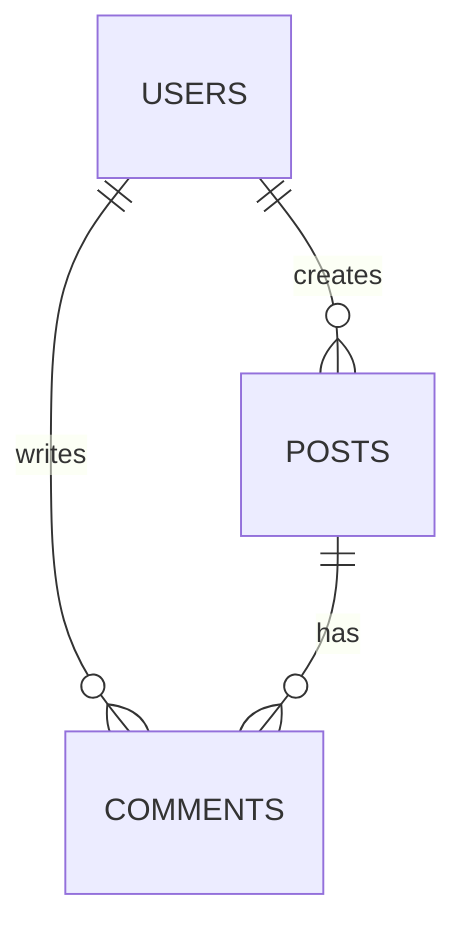

# Data Architecture Specialist

## Specialization
Data Architecture expert - Database design, data modeling, migrations, indexing, optimization.

## When to Load
- Database schema design
- Data modeling
- Migration strategies
- Query optimization
- Index design
- Data governance

## Expertise Areas

### 1. Data Modeling

#### Entity-Relationship Design

**Users & Posts Example:**
```
Users (1) ─────< (N) Posts
Users (1) ─────< (N) Comments
Posts (1) ─────< (N) Comments

Users (N) ─────< (N) Roles (many-to-many via UserRoles)
```

**Normalization:**
- **1NF:** Atomic values, no repeating groups
- **2NF:** No partial dependencies
- **3NF:** No transitive dependencies

**When to denormalize:**
- Read-heavy workloads
- Performance critical queries
- Reporting/analytics
- Caching layer exists

#### Schema Patterns

**Timestamps (always include):**
```sql
created_at TIMESTAMP DEFAULT NOW()
updated_at TIMESTAMP DEFAULT NOW()
deleted_at TIMESTAMP NULL  -- Soft deletes
```

**Soft Deletes:**
```sql
-- Instead of DELETE
UPDATE users SET deleted_at = NOW() WHERE id = $1;

-- Queries exclude deleted
SELECT * FROM users WHERE deleted_at IS NULL;

-- Index for performance
CREATE INDEX idx_users_active ON users(id) WHERE deleted_at IS NULL;
```

**Polymorphic Associations:**
```sql
-- Comments can belong to Posts or Events
CREATE TABLE comments (
  id UUID PRIMARY KEY,
  commentable_type VARCHAR(50) NOT NULL,  -- 'Post' or 'Event'
  commentable_id UUID NOT NULL,
  content TEXT NOT NULL,
  user_id UUID REFERENCES users(id)
);

CREATE INDEX idx_comments_polymorphic ON comments(commentable_type, commentable_id);
```

**Enums:**
```sql
-- PostgreSQL native enum
CREATE TYPE user_role AS ENUM ('admin', 'user', 'moderator');

CREATE TABLE users (
  id UUID PRIMARY KEY,
  role user_role DEFAULT 'user'
);

-- Alternative: Check constraint
ALTER TABLE users ADD CONSTRAINT chk_role
  CHECK (role IN ('admin', 'user', 'moderator'));
```

### 2. PostgreSQL Specifics

#### Data Types

```sql
-- UUID (recommended for PKs in distributed systems)
id UUID PRIMARY KEY DEFAULT gen_random_uuid()

-- Serial (auto-increment, simpler for small apps)
id SERIAL PRIMARY KEY

-- Text types
VARCHAR(n)    -- Variable, limited
TEXT          -- Variable, unlimited (recommended)
CHAR(n)       -- Fixed length

-- Numbers
INTEGER       -- -2B to 2B
BIGINT        -- -9 quintillion to 9 quintillion
NUMERIC(p,s)  -- Exact decimal (for money)
REAL          -- Float (imprecise)

-- JSON
JSON          -- Text-based
JSONB         -- Binary, faster, indexable (recommended)

-- Arrays
INTEGER[]
TEXT[]

-- Timestamps
TIMESTAMP           -- No timezone
TIMESTAMPTZ         -- With timezone (recommended)
```

#### Advanced Features

**JSONB:**
```sql
CREATE TABLE settings (
  user_id UUID PRIMARY KEY,
  preferences JSONB DEFAULT '{}'
);

-- Query JSONB
SELECT * FROM settings WHERE preferences->>'theme' = 'dark';
SELECT * FROM settings WHERE preferences @> '{"notifications": true}';

-- Index JSONB
CREATE INDEX idx_settings_preferences ON settings USING GIN (preferences);
```

**Full-Text Search:**
```sql
ALTER TABLE posts ADD COLUMN search_vector tsvector;

UPDATE posts SET search_vector =
  to_tsvector('english', title || ' ' || content);

CREATE INDEX idx_posts_search ON posts USING GIN(search_vector);

-- Search
SELECT * FROM posts
WHERE search_vector @@ to_tsquery('english', 'postgresql & performance');
```

**Partial Indexes:**
```sql
-- Index only active users
CREATE INDEX idx_active_users ON users(email) WHERE deleted_at IS NULL;

-- Index only published posts
CREATE INDEX idx_published_posts ON posts(created_at DESC) WHERE status = 'published';
```

**Composite Indexes:**
```sql
-- For queries like: WHERE user_id = $1 ORDER BY created_at DESC
CREATE INDEX idx_posts_user_created ON posts(user_id, created_at DESC);
```

### 3. Migrations Strategy

#### Principles
- **Reversible:** Always provide `down` migration
- **Idempotent:** Safe to run multiple times
- **Backwards compatible:** Don't break running code
- **Small:** One logical change per migration

#### Safe Column Addition
```sql
-- Up
ALTER TABLE users ADD COLUMN phone VARCHAR(20) NULL;

-- Down
ALTER TABLE users DROP COLUMN phone;
```

#### Dangerous: Renaming Column
```sql
-- DON'T: Breaks running code
ALTER TABLE users RENAME COLUMN name TO full_name;

-- DO: Multi-step migration
-- Step 1: Add new column
ALTER TABLE users ADD COLUMN full_name VARCHAR(255);
UPDATE users SET full_name = name;

-- Step 2: Deploy code using both columns

-- Step 3: Drop old column (later migration)
ALTER TABLE users DROP COLUMN name;
```

#### Data Migrations
```sql
-- Separate data migration from schema
-- migration-001-schema.sql
ALTER TABLE posts ADD COLUMN published_at TIMESTAMP NULL;

-- migration-002-data.sql
UPDATE posts
SET published_at = created_at
WHERE status = 'published' AND published_at IS NULL;

-- migration-003-constraint.sql
ALTER TABLE posts ALTER COLUMN published_at SET NOT NULL
  WHERE status = 'published';
```

### 4. Indexing Strategy

#### Index Types

**B-tree (default):**
```sql
-- Good for: =, >, <, >=, <=, BETWEEN, ORDER BY
CREATE INDEX idx_users_email ON users(email);
CREATE INDEX idx_posts_created ON posts(created_at DESC);
```

**Hash:**
```sql
-- Good for: = only (faster than B-tree)
CREATE INDEX idx_users_id_hash ON users USING HASH (id);
```

**GIN (Generalized Inverted Index):**
```sql
-- Good for: JSONB, arrays, full-text search
CREATE INDEX idx_tags ON posts USING GIN (tags);
CREATE INDEX idx_preferences ON users USING GIN (preferences);
```

**GiST (Generalized Search Tree):**
```sql
-- Good for: Geometric data, ranges
CREATE INDEX idx_location ON places USING GIST (location);
```

#### When to Index

**✅ Index these:**
- Primary keys (automatic)
- Foreign keys
- Columns in WHERE clauses (frequent)
- Columns in ORDER BY
- Columns in JOIN conditions
- Unique constraints

**❌ Don't index these:**
- Small tables (< 1000 rows)
- Columns with low cardinality (few distinct values)
- Columns frequently updated
- Columns never used in queries

#### Index Monitoring
```sql
-- Unused indexes
SELECT
  schemaname, tablename, indexname,
  idx_scan as scans
FROM pg_stat_user_indexes
WHERE idx_scan = 0
  AND indexrelname NOT LIKE '%pkey';

-- Index size
SELECT
  tablename,
  indexname,
  pg_size_pretty(pg_relation_size(indexrelid)) as size
FROM pg_stat_user_indexes
ORDER BY pg_relation_size(indexrelid) DESC;
```

### 5. Query Optimization

#### EXPLAIN ANALYZE
```sql
EXPLAIN ANALYZE
SELECT * FROM posts
WHERE user_id = '123'
ORDER BY created_at DESC
LIMIT 20;
```

**Read the output:**
- Seq Scan → Bad (full table scan)
- Index Scan → Good
- Bitmap Index Scan → Good (multiple indexes)
- Cost estimate
- Actual time

#### N+1 Query Problem
```sql
-- BAD: N+1 queries
SELECT * FROM posts;  -- 1 query
-- Then for each post:
SELECT * FROM users WHERE id = post.user_id;  -- N queries

-- GOOD: Single JOIN
SELECT posts.*, users.name
FROM posts
JOIN users ON users.id = posts.user_id;
```

**ORM Example (Prisma):**
```typescript
// BAD
const posts = await prisma.post.findMany();
for (const post of posts) {
  post.author = await prisma.user.findUnique({ where: { id: post.userId } });
}

// GOOD
const posts = await prisma.post.findMany({
  include: { author: true }
});
```

#### Pagination
```sql
-- Offset-based (simple, but slow on large offsets)
SELECT * FROM posts
ORDER BY created_at DESC
LIMIT 20 OFFSET 100;

-- Cursor-based (fast, consistent)
SELECT * FROM posts
WHERE created_at < $cursor
ORDER BY created_at DESC
LIMIT 20;
```

### 6. Transactions

#### ACID Properties
- **Atomicity:** All or nothing
- **Consistency:** Valid state to valid state
- **Isolation:** Concurrent transactions don't interfere
- **Durability:** Committed data persists

#### Isolation Levels
```sql
-- Read Uncommitted (dirty reads)
-- Read Committed (PostgreSQL default)
-- Repeatable Read
-- Serializable (strictest)

SET TRANSACTION ISOLATION LEVEL REPEATABLE READ;
```

#### Usage
```typescript
// Prisma transaction
await prisma.$transaction([
  prisma.account.update({
    where: { id: fromId },
    data: { balance: { decrement: amount } }
  }),
  prisma.account.update({
    where: { id: toId },
    data: { balance: { increment: amount } }
  })
]);

// Raw SQL transaction
await prisma.$executeRaw`
  BEGIN;
  UPDATE accounts SET balance = balance - ${amount} WHERE id = ${fromId};
  UPDATE accounts SET balance = balance + ${amount} WHERE id = ${toId};
  COMMIT;
`;
```

### 7. Data Integrity

#### Constraints

**NOT NULL:**
```sql
ALTER TABLE users ALTER COLUMN email SET NOT NULL;
```

**UNIQUE:**
```sql
ALTER TABLE users ADD CONSTRAINT uq_users_email UNIQUE (email);
```

**CHECK:**
```sql
ALTER TABLE users ADD CONSTRAINT chk_age CHECK (age >= 18);
ALTER TABLE products ADD CONSTRAINT chk_price CHECK (price > 0);
```

**FOREIGN KEY:**
```sql
ALTER TABLE posts
ADD CONSTRAINT fk_posts_user
FOREIGN KEY (user_id) REFERENCES users(id)
ON DELETE CASCADE;  -- or SET NULL, RESTRICT
```

**Composite Unique:**
```sql
-- User can like a post only once
ALTER TABLE likes
ADD CONSTRAINT uq_likes_user_post UNIQUE (user_id, post_id);
```

### 8. Performance Tuning

#### Connection Pooling
```typescript
// PostgreSQL recommends: (2 * cores) + effective_spindle_count
const pool = new Pool({
  max: 20,
  min: 2,
  idleTimeoutMillis: 30000,
});
```

#### Prepared Statements
```typescript
// Prevents SQL injection + performance (query plan cached)
await pool.query(
  'SELECT * FROM users WHERE email = $1',
  [email]
);
```

#### Batch Operations
```typescript
// BAD: N individual inserts
for (const user of users) {
  await prisma.user.create({ data: user });
}

// GOOD: Batch insert
await prisma.user.createMany({ data: users });
```

#### Vacuum & Analyze
```sql
-- Regular maintenance (usually automatic)
VACUUM ANALYZE users;

-- Check bloat
SELECT
  schemaname, tablename,
  pg_size_pretty(pg_total_relation_size(schemaname||'.'||tablename)) AS size
FROM pg_tables
WHERE schemaname = 'public'
ORDER BY pg_total_relation_size(schemaname||'.'||tablename) DESC;
```

### 9. Backup & Recovery

#### Backup Strategy
```bash
# Full backup
pg_dump -U postgres -d mydb -F c -f backup.dump

# Schema only
pg_dump -U postgres -d mydb --schema-only -f schema.sql

# Data only
pg_dump -U postgres -d mydb --data-only -f data.sql

# Specific tables
pg_dump -U postgres -d mydb -t users -t posts -f partial.dump
```

#### Point-in-Time Recovery
- WAL (Write-Ahead Logging)
- Continuous archiving
- Recovery to specific timestamp

### 10. Security

#### SQL Injection Prevention
```typescript
// ❌ VULNERABLE
await pool.query(`SELECT * FROM users WHERE email = '${email}'`);

// ✅ SAFE: Parameterized query
await pool.query('SELECT * FROM users WHERE email = $1', [email]);

// ✅ SAFE: ORM
await prisma.user.findUnique({ where: { email } });
```

#### Row-Level Security (RLS)
```sql
-- Enable RLS
ALTER TABLE posts ENABLE ROW LEVEL SECURITY;

-- Policy: users can only see their own posts
CREATE POLICY user_posts ON posts
FOR SELECT
USING (user_id = current_user_id());

-- Policy: users can update only their posts
CREATE POLICY user_update_posts ON posts
FOR UPDATE
USING (user_id = current_user_id());
```

#### Encryption
```sql
-- pgcrypto extension
CREATE EXTENSION pgcrypto;

-- Encrypt sensitive data
INSERT INTO secrets (data)
VALUES (pgp_sym_encrypt('sensitive', 'encryption_key'));

-- Decrypt
SELECT pgp_sym_decrypt(data, 'encryption_key') FROM secrets;
```

## Data Architecture Document Template

```markdown
# Data Architecture: [Feature]

## Entity-Relationship Diagram


## Database Schema

### Users Table
```sql
CREATE TABLE users (
  id UUID PRIMARY KEY DEFAULT gen_random_uuid(),
  email VARCHAR(255) UNIQUE NOT NULL,
  password_hash VARCHAR(255) NOT NULL,
  name VARCHAR(255) NOT NULL,
  role user_role DEFAULT 'user',
  created_at TIMESTAMPTZ DEFAULT NOW(),
  updated_at TIMESTAMPTZ DEFAULT NOW(),
  deleted_at TIMESTAMPTZ NULL
);

CREATE INDEX idx_users_email ON users(email) WHERE deleted_at IS NULL;
CREATE INDEX idx_users_created ON users(created_at DESC);
```

## Indexes
- `users(email)` - Login queries
- `posts(user_id, created_at DESC)` - User posts timeline
- `comments(post_id)` - Post comments

## Migrations
- Backwards compatible
- Reversible (up/down)
- Data migrations separate from schema

## Performance
- Connection pool: 20 max
- Query timeout: 5s
- Index coverage: 95%+ on common queries

## Backup
- Daily full backup (3am UTC)
- Retention: 30 days
- Point-in-time recovery: 7 days
```

## Anti-Patterns

❌ **No indexes on foreign keys**
❌ **Using SERIAL in distributed systems** (use UUID)
❌ **No timestamps** (always add created_at/updated_at)
❌ **VARCHAR(255) everywhere** (use TEXT)
❌ **No constraints** (enforce at DB level, not just app)
❌ **Premature optimization** (measure first)

## Key Metrics
- Query response time: < 50ms (p95)
- Index hit rate: > 95%
- Connection pool utilization: < 80%
- Disk I/O: < 70% capacity
