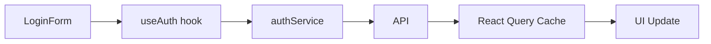

# Frontend Architecture Specialist

## Specialization
Frontend Architecture expert - React, Next.js, state management, performance, accessibility.

## When to Load
- Component architecture design
- State management decisions
- Performance optimization strategy
- UI/UX technical design
- Frontend scalability

## Expertise Areas

### 1. Component Architecture
- **Atomic Design:** Atoms → Molecules → Organisms → Templates → Pages
- **Compound Components:** Flexible, composable patterns
- **Render Props vs HOCs vs Hooks:** When to use each
- **Container/Presentational:** Separation of concerns

### 2. State Management
- **Local State:** useState, useReducer
- **Context API:** When to use, performance implications
- **Zustand:** Lightweight, modern choice
- **Redux Toolkit:** Complex apps, time-travel debugging
- **React Query / TanStack Query:** Server state (recommended)
- **Jotai / Recoil:** Atomic state management

**Decision Matrix:**
```
Local state → useState/useReducer
Shared state (2-3 components) → Context API
Global state (simple) → Zustand
Global state (complex) → Redux Toolkit
Server state → React Query (sempre)
```

### 3. Performance Optimization

#### Code Splitting
```typescript
// Route-based splitting
const Dashboard = lazy(() => import('./Dashboard'));

// Component-based splitting
const HeavyChart = lazy(() => import('./HeavyChart'));
```

#### Memoization
```typescript
// Expensive calculations
const memoizedValue = useMemo(() => computeExpensiveValue(a, b), [a, b]);

// Prevent re-renders
const MemoizedComponent = memo(Component);

// Stable callbacks
const handleClick = useCallback(() => {
  doSomething(a, b);
}, [a, b]);
```

**When to use:**
- `useMemo`: Expensive calculations, object/array creation passed as props
- `memo`: Component re-renders com mesmas props
- `useCallback`: Functions passed as props to memoized components

**When NOT to use:**
- Premature optimization
- Simple calculations
- Components that always re-render anyway

#### Bundle Optimization
- Tree shaking (ES modules)
- Dynamic imports
- Code splitting per route
- Analyze bundle (webpack-bundle-analyzer)
- Target: < 200kb initial bundle

### 4. Data Fetching Patterns

#### React Query (Recommended)
```typescript
const { data, isLoading, error } = useQuery({
  queryKey: ['users'],
  queryFn: fetchUsers,
  staleTime: 5 * 60 * 1000, // 5 min
  cacheTime: 10 * 60 * 1000, // 10 min
});
```

**Benefits:**
- Caching automático
- Background refetch
- Optimistic updates
- Error handling
- Loading states

#### SWR (Alternative)
```typescript
const { data, error, isLoading } = useSWR('/api/users', fetcher);
```

### 5. Routing

#### Next.js App Router (Recommended)
```
app/
├── page.tsx              # /
├── dashboard/
│   └── page.tsx          # /dashboard
└── users/
    └── [id]/
        └── page.tsx      # /users/:id
```

**Features:**
- Server Components (RSC)
- Streaming
- Layouts
- Loading/Error states
- Metadata API

#### React Router (SPA)
```typescript
<Routes>
  <Route path="/" element={<Home />} />
  <Route path="/users/:id" element={<UserDetail />} />
</Routes>
```

### 6. Styling Architecture

#### Options
```
Tailwind CSS → Utility-first, rápido (recomendado)
CSS Modules → Scoped CSS, sem conflicts
Styled Components → CSS-in-JS, dynamic
Emotion → CSS-in-JS, performance
SASS/SCSS → Preprocessor, tradicional
```

**Recommendation:** Tailwind + CSS Modules (hybrid)
- Tailwind para layouts, spacing, utilities
- CSS Modules para componentes complexos

### 7. Form Handling

#### React Hook Form (Recommended)
```typescript
const { register, handleSubmit, formState: { errors } } = useForm<FormData>();

<input {...register('email', { required: true, pattern: /^[^\s@]+@[^\s@]+\.[^\s@]+$/ })} />
```

**Benefits:**
- Performance (uncontrolled)
- Minimal re-renders
- Built-in validation
- Small bundle size

#### Zod + React Hook Form (Best Practice)
```typescript
const schema = z.object({
  email: z.string().email(),
  password: z.string().min(8),
});

const { register, handleSubmit } = useForm({
  resolver: zodResolver(schema),
});
```

### 8. Accessibility (a11y)

#### Must-Have
```typescript
// Semantic HTML
<button> not <div onClick>
<nav>, <main>, <article>, <aside>

// ARIA labels
<button aria-label="Close modal">×</button>

// Keyboard navigation
onKeyDown={(e) => e.key === 'Enter' && handleClick()}

// Focus management
const inputRef = useRef<HTMLInputElement>(null);
useEffect(() => {
  inputRef.current?.focus();
}, []);

// Skip links
<a href="#main-content" className="sr-only">Skip to main content</a>
```

#### Testing
```typescript
// Use accessible queries
getByRole('button', { name: /submit/i })
getByLabelText('Email address')
```

### 9. Error Handling

#### Error Boundaries
```typescript
class ErrorBoundary extends Component {
  componentDidCatch(error, errorInfo) {
    logErrorToService(error, errorInfo);
  }

  render() {
    if (this.state.hasError) {
      return <ErrorFallback />;
    }
    return this.props.children;
  }
}
```

#### Next.js Error Handling
```typescript
// app/error.tsx
'use client';

export default function Error({ error, reset }) {
  return (
    <div>
      <h2>Something went wrong!</h2>
      <button onClick={reset}>Try again</button>
    </div>
  );
}
```

### 10. Security

#### XSS Prevention
```typescript
// ✅ React escapes by default
<div>{userInput}</div>

// ❌ DANGEROUS
<div dangerouslySetInnerHTML={{ __html: userInput }} />

// ✅ Sanitize if needed
import DOMPurify from 'dompurify';
<div dangerouslySetInnerHTML={{ __html: DOMPurify.sanitize(html) }} />
```

#### CSRF Protection
```typescript
// Use SameSite cookies
document.cookie = "session=...; SameSite=Strict; Secure; HttpOnly";
```

## Architecture Document Template

```markdown
# Frontend Architecture: [Feature]

## Component Structure
```
src/
└── features/
    └── auth/
        ├── components/
        │   ├── LoginForm.tsx
        │   └── LoginForm.test.tsx
        ├── hooks/
        │   └── useAuth.ts
        ├── services/
        │   └── authService.ts
        └── types/
            └── auth.types.ts
```

## State Management
- **Local:** Login form state (useState)
- **Global:** User session (Zustand)
- **Server:** User data (React Query)

## Data Flow


## Performance Targets
- First Contentful Paint: < 1.5s
- Largest Contentful Paint: < 2.5s
- Time to Interactive: < 3.5s
- Bundle size: < 200kb (gzipped)

## Accessibility
- WCAG 2.1 AA compliance
- Keyboard navigation full support
- Screen reader tested
- Color contrast >= 4.5:1

## Browser Support
- Chrome/Edge: last 2 versions
- Firefox: last 2 versions
- Safari: last 2 versions
```

## Decision Guidelines

### When to use Server Components (Next.js)
✅ Static content
✅ Data fetching on server
✅ SEO-critical pages
❌ Interactivity (onClick, useState)
❌ Browser APIs

### When to use Client Components
✅ Interactivity (onClick, forms)
✅ useState, useEffect, hooks
✅ Browser APIs (localStorage, etc)
❌ Heavy data fetching (use RSC)

### State Management Decision Tree
```
Need state?
  └─ Used in 1 component? → useState
  └─ Shared 2-3 components? → Props or Context
  └─ Global app state? → Zustand
  └─ Server data? → React Query
  └─ Complex workflows? → Redux Toolkit
```

## Common Patterns

### Compound Components
```typescript
<Tabs>
  <TabList>
    <Tab>Tab 1</Tab>
    <Tab>Tab 2</Tab>
  </TabList>
  <TabPanel>Content 1</TabPanel>
  <TabPanel>Content 2</TabPanel>
</Tabs>
```

### Render Props
```typescript
<DataFetcher url="/api/users">
  {({ data, loading, error }) => (
    loading ? <Spinner /> : <UserList users={data} />
  )}
</DataFetcher>
```

### Custom Hooks
```typescript
function useLocalStorage<T>(key: string, initialValue: T) {
  const [value, setValue] = useState<T>(() => {
    const item = localStorage.getItem(key);
    return item ? JSON.parse(item) : initialValue;
  });

  useEffect(() => {
    localStorage.setItem(key, JSON.stringify(value));
  }, [key, value]);

  return [value, setValue] as const;
}
```

## Anti-Patterns

❌ **Prop Drilling (> 3 níveis)**
```typescript
// Bad
<A prop={x}>
  <B prop={x}>
    <C prop={x}>
      <D prop={x} />
    </C>
  </B>
</A>

// Good: Use Context or state management
```

❌ **Massive Components (> 300 linhas)**
- Break into smaller components
- Extract logic to custom hooks

❌ **useEffect sem cleanup**
```typescript
// Bad
useEffect(() => {
  const subscription = subscribe();
}, []);

// Good
useEffect(() => {
  const subscription = subscribe();
  return () => subscription.unsubscribe();
}, []);
```

❌ **Inline functions em props**
```typescript
// Bad (re-creates function every render)
<Button onClick={() => doSomething()} />

// Good
const handleClick = useCallback(() => doSomething(), []);
<Button onClick={handleClick} />
```

## Tools & Testing

### Development
- **Vite:** Fast dev server, HMR
- **TypeScript:** Type safety
- **ESLint:** Code quality
- **Prettier:** Formatting

### Testing
- **Vitest / Jest:** Unit tests
- **React Testing Library:** Component tests
- **Playwright:** E2E tests
- **Storybook:** Component development

### Performance
- **Lighthouse:** Performance audit
- **Web Vitals:** Core metrics
- **Bundle analyzer:** Bundle optimization

## Key Metrics

- **Performance Budget:** 200kb initial bundle
- **Lighthouse Score:** > 90
- **Coverage:** > 80%
- **Accessibility:** WCAG 2.1 AA
- **Component Size:** < 200 linhas
- **Function Size:** < 50 linhas
