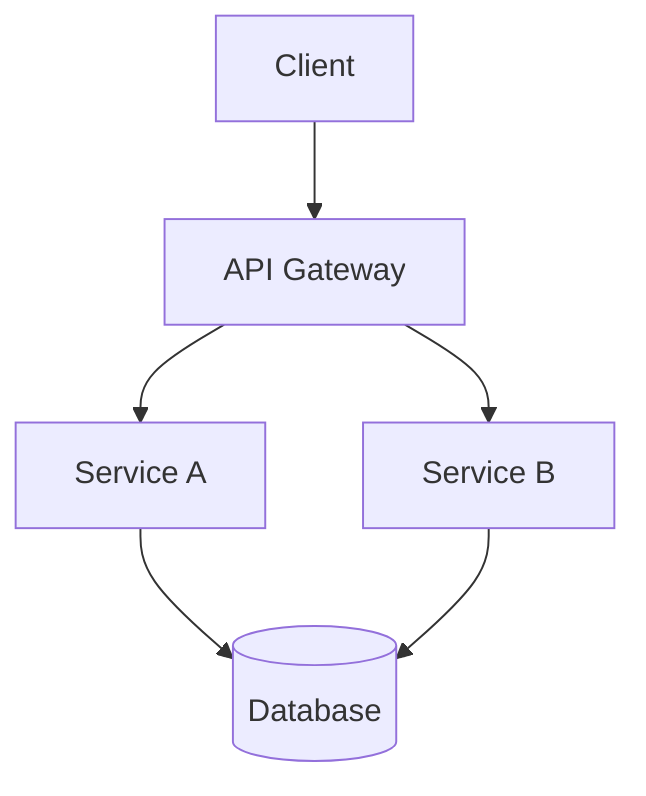

# Architecture: [Feature Name]

## 1. System Overview



[High-level description of the system]

---

## 2. Tech Stack

**Frontend:**
- Framework: [React, Vue, Next.js, etc]
- Language: [TypeScript, JavaScript]
- State Management: [Zustand, Redux, Context]
- Styling: [Tailwind, CSS Modules, Styled Components]

**Backend:**
- Runtime: [Node.js, Python, Go]
- Framework: [Express, FastAPI, Gin]
- Language: [TypeScript, Python, Go]
- Database: [PostgreSQL, MongoDB, MySQL]
- Cache: [Redis, Memcached]

**Infrastructure:**
- Hosting: [AWS, GCP, Azure, Vercel]
- CI/CD: [GitHub Actions, GitLab CI]
- Containerization: [Docker]

---

## 3. Components

### Component: [Component Name]

**Responsibility:**
[What this component does]

**Technologies:**
[Specific tech used]

**Interfaces:**
- **Input:** [Data format, API, events]
- **Output:** [Data format, API, events]

**Dependencies:**
[Other components it depends on]

---

## 4. Data Model

```typescript
// TypeScript interfaces or SQL schema

interface User {
  id: string;
  email: string;
  name: string;
  createdAt: Date;
  updatedAt: Date;
}

// Or SQL
CREATE TABLE users (
  id UUID PRIMARY KEY,
  email VARCHAR(255) UNIQUE NOT NULL,
  name VARCHAR(255) NOT NULL,
  created_at TIMESTAMP DEFAULT NOW()
);
```

---

## 5. API Design

```
# Users
GET    /api/users           # List users (paginated)
GET    /api/users/:id       # Get user by ID
POST   /api/users           # Create user
PATCH  /api/users/:id       # Update user
DELETE /api/users/:id       # Delete user

# Authentication
POST   /api/auth/login      # Login
POST   /api/auth/refresh    # Refresh token
POST   /api/auth/logout     # Logout
```

**Example Request/Response:**
```json
POST /api/users
{
  "email": "user@example.com",
  "password": "password123",
  "name": "John Doe"
}

Response: 201 Created
{
  "id": "uuid",
  "email": "user@example.com",
  "name": "John Doe",
  "createdAt": "2024-01-01T00:00:00Z"
}
```

---

## 6. Security Considerations

- **Authentication:** [JWT, OAuth, Sessions]
- **Authorization:** [RBAC, ABAC]
- **Data Protection:** [Encryption at rest/transit]
- **Input Validation:** [Zod, Joi, etc]
- **Rate Limiting:** [Limits and strategy]
- **OWASP Top 10:** [How addressed]

---

## 7. Performance Considerations

- **Caching:** [Strategy, TTL, invalidation]
- **Database:** [Indexing strategy, connection pooling]
- **API:** [Response time targets, pagination]
- **Frontend:** [Code splitting, lazy loading, bundle size]

---

## 8. Scalability Design

- **Horizontal Scaling:** [How components scale]
- **Load Balancing:** [Strategy]
- **Database:** [Read replicas, sharding if needed]
- **Caching:** [Redis for session/data]

---

## 9. Folder Structure

```
src/
├── frontend/
│   ├── components/
│   ├── pages/
│   ├── hooks/
│   └── services/
├── backend/
│   ├── controllers/
│   ├── services/
│   ├── repositories/
│   ├── middleware/
│   └── routes/
└── shared/
    └── types/
```

---

## 10. ADRs (Architecture Decision Records)

### ADR-001: [Decision Title]

**Context:**
[What situation led to this decision]

**Decision:**
[What was decided]

**Consequences:**
- ✅ Positive consequence 1
- ✅ Positive consequence 2
- ⚠️ Trade-off or limitation

### ADR-002: [Next Decision]
...

---

## 11. Deployment Strategy

- **Environments:** Dev, Staging, Production
- **CI/CD:** [Pipeline description]
- **Rollback:** [How to rollback if needed]
- **Monitoring:** [What is monitored]
